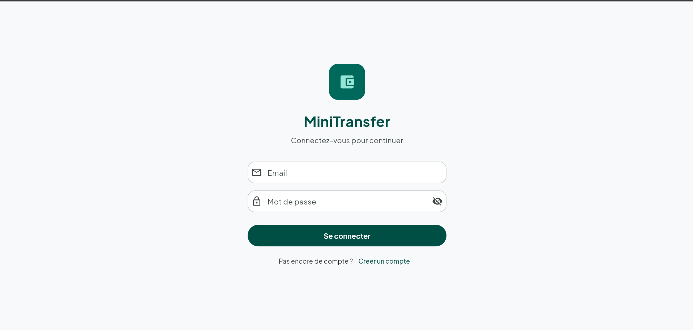
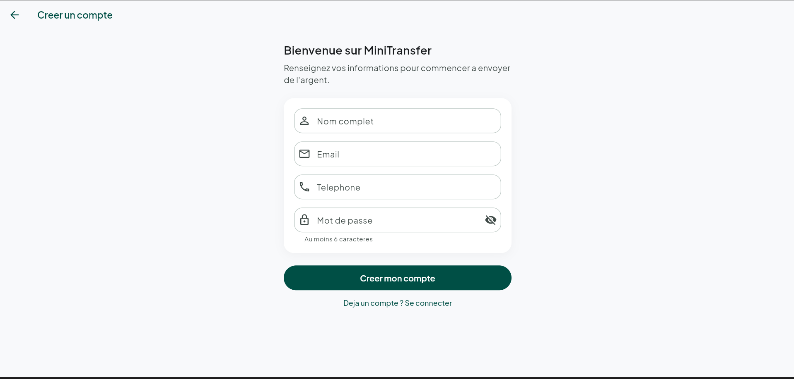
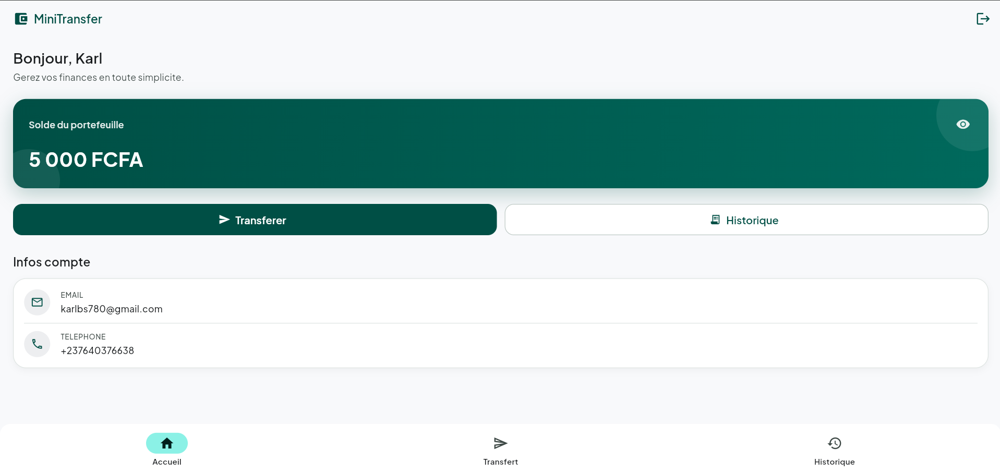
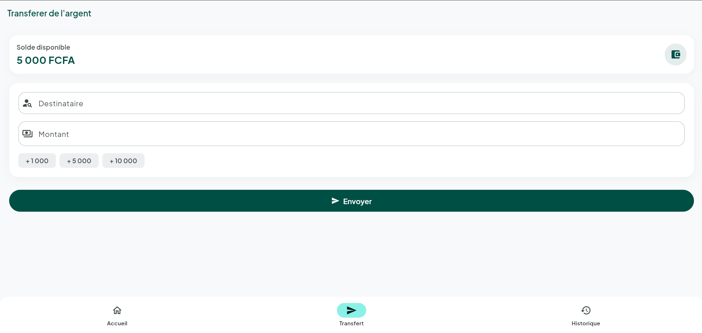
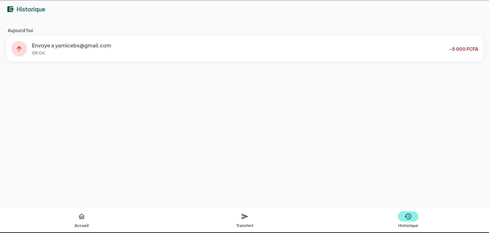

# MiniTransfer — Mini-plateforme de transfert d'argent

> Test technique — Développeur Fullstack Junior — TGB Solutions SARL
> Référence : **TGB-TT-STG-FSJ-2026-001**

Application complète de transfert d'argent simplifiée : un utilisateur s'inscrit, reçoit un
portefeuille de démonstration (10 000 FCFA), consulte son solde, envoie de l'argent à un autre
utilisateur et consulte l'historique de ses transactions.

**Stack :** Flutter (mobile) · Java 21 / Spring Boot 3 (API REST) · MongoDB · Docker / docker-compose

---

## Captures d'écran

| Connexion | Inscription | Accueil |
|:---:|:---:|:---:|
|  |  |  |

| Transfert | Historique |
|:---:|:---:|
|  |  |

---

## Sommaire

1. [Fonctionnalités](#fonctionnalités)
2. [Architecture du projet](#architecture-du-projet)
3. [Choix techniques (et justifications)](#choix-techniques-et-justifications)
4. [Prérequis](#prérequis)
5. [Démarrage rapide avec Docker (recommandé)](#démarrage-rapide-avec-docker-recommandé)
6. [Démarrage manuel](#démarrage-manuel)
7. [Lancer l'application mobile](#lancer-lapplication-mobile)
8. [Référence de l'API REST](#référence-de-lapi-rest)
9. [Codes d'erreur](#codes-derreur)
10. [Tests](#tests)
11. [Limites connues](#limites-connues)
12. [Temps passé](#temps-passé)

---

## Fonctionnalités

- **Comptes** : inscription (nom, email, téléphone, mot de passe), connexion par **JWT**.
- **Portefeuille** : chaque compte est créé avec un solde de démonstration de **10 000 FCFA**.
- **Transfert** : envoi d'argent vers un autre utilisateur identifié par **email ou téléphone**.
- **Historique** : transactions envoyées et reçues, triées par date décroissante.
- **Règles métier** :
  - solde insuffisant → transfert refusé avec message clair ;
  - transfert vers soi-même ou vers un destinataire inexistant → rejeté ;
  - montant strictement positif obligatoire ;
  - chaque transaction est enregistrée (émetteur, destinataire, montant, date/heure, statut).

---

## Architecture du projet

```
test junir/
├── backend/                 # API REST Java / Spring Boot 3
│   ├── src/main/java/com/tgb/minitransfer/
│   │   ├── config/          # SecurityConfig, AppProperties
│   │   ├── controller/      # AuthController, WalletController, TransferController
│   │   ├── dto/             # Objets de requête/réponse (records)
│   │   ├── exception/       # ApiException + GlobalExceptionHandler
│   │   ├── model/           # User, Transaction (documents MongoDB)
│   │   ├── repository/      # Spring Data MongoDB
│   │   ├── security/        # JwtService, JwtAuthenticationFilter, entry point
│   │   └── service/         # AuthService, WalletService, TransferService...
│   ├── src/test/java/...    # Tests unitaires (JUnit 5 + Mockito)
│   ├── Dockerfile           # Build multi-stage (Maven -> JRE 21)
│   └── pom.xml
├── mobile/                  # Application Flutter
│   └── lib/
│       ├── config/          # URL de l'API
│       ├── models/          # AppUser, TransactionModel, ...
│       ├── services/        # ApiClient, AuthApi, WalletApi, TransferApi, TokenStorage
│       ├── providers/       # AuthProvider, WalletProvider (gestion d'état)
│       ├── screens/         # login, register, home, transfer, history
│       ├── widgets/         # composants réutilisables
│       └── utils/           # formatage FCFA / dates, feedback UI
├── api/                     # Collection Postman + fichier .http
├── docker-compose.yml       # MongoDB + backend en une commande
└── README.md
```

---

## Choix techniques (et justifications)

### Backend — Spring Boot 3 / Java 21
- Architecture en couches **controller → service → repository** pour séparer les responsabilités.
- **Spring Security + JWT (HS256)** via la librairie `jjwt`. Le filtre `JwtAuthenticationFilter`
  valide le token et place l'`id` utilisateur comme *principal* ; l'API est **stateless**.
- **Validation** des entrées par annotations (`@NotBlank`, `@Email`, `@Positive`...).
- **Gestion centralisée des erreurs** (`@RestControllerAdvice`) : toutes les erreurs renvoient le
  même format JSON avec un code machine, un message et le bon statut HTTP.
- Mots de passe hachés avec **BCrypt** (jamais stockés en clair).

### Modélisation MongoDB
Deux collections : **`users`** et **`transactions`**.

- **Le solde est embarqué dans le document `user`** (champ `balance`) plutôt que dans une collection
  `wallets` séparée. Justification : la relation utilisateur ↔ portefeuille est **1:1**, l'embarquement
  évite une jointure et surtout permet des mises à jour de solde **atomiques** via `$inc` sur un seul
  document.
- **Les montants sont des entiers (`long`) en FCFA** — jamais de nombres flottants pour de l'argent
  (pas d'erreur d'arrondi).
- Index uniques sur `users.email` et `users.phone` ; index sur `transactions.senderId` /
  `recipientId` pour l'historique.

### Cohérence des transferts (ne jamais perdre ni créer d'argent)
Un transfert touche **deux documents**. MongoDB en mode standalone (le cas par défaut de
docker-compose) ne fournit pas de transactions multi-documents. La cohérence est donc garantie par
**deux mises à jour atomiques + compensation** (`TransferService`) :

1. **Débit conditionnel** de l'émetteur : `update({_id, balance >= montant}, {$inc: -montant})`.
   Si rien n'est modifié → solde insuffisant, on s'arrête.
2. **Crédit** du destinataire : `update({_id}, {$inc: +montant})`.
   Si le crédit échoue → on **rembourse** l'émetteur (compensation) ; aucun argent n'est perdu.
3. **Enregistrement** de la transaction (statut `COMPLETED`, ou `FAILED` en cas de compensation).

### Mobile — Flutter
- **Gestion d'état : `provider`** (`ChangeNotifier`). Choisi pour sa simplicité et sa lisibilité,
  adapté au périmètre de l'application : `AuthProvider` (session/utilisateur) et `WalletProvider`
  (solde + historique).
- **Stockage du JWT : `flutter_secure_storage`** (Keystore Android / Keychain iOS), plus sûr que
  `shared_preferences` pour un token.
- Couche réseau isolée (`ApiClient`) qui ajoute le header `Authorization`, décode le JSON et convertit
  les réponses non-2xx en `ApiException` typée → messages d'erreur conviviaux, indicateurs de
  chargement sur chaque action.
- **Design Material 3** : palette teal et police *Plus Jakarta Sans* (embarquée, rendu garanti hors-ligne),
  **navigation par barre inférieure** (Accueil / Transfert / Historique), carte de solde masquable et
  raccourcis de montant.

---

## Prérequis

| Outil      | Version utilisée | Remarque                                  |
|------------|------------------|-------------------------------------------|
| **Java**   | 21 (LTS)         | requis pour le backend (Spring Boot 3)    |
| **Maven**  | 3.9+             | inclus si vous utilisez Docker            |
| **Flutter**| 3.44+ (Dart 3.12)| pour l'application mobile                 |
| **MongoDB**| 7.x              | fourni par docker-compose                 |
| **Docker** | 24+ / Compose v2 | pour le démarrage en une commande (bonus) |

> Avec **Docker**, seuls Docker et Flutter sont nécessaires : Java, Maven et MongoDB sont gérés par les conteneurs.

---

## Démarrage rapide avec Docker (recommandé)

À la racine du projet :

```bash
docker compose up --build
```

Cette commande :
- démarre **MongoDB** (publié sur le port hôte `27018` pour éviter tout conflit avec un MongoDB local) ;
- construit et démarre le **backend** (port `8080`), connecté automatiquement à MongoDB ;
- attend que MongoDB soit *healthy* avant de lancer le backend.

Vérifier que l'API répond :

```bash
curl http://localhost:8080/actuator/health
# {"status":"UP"}
```

Pour tout arrêter : `Ctrl+C` puis `docker compose down` (ajouter `-v` pour effacer les données Mongo).

---

## Démarrage manuel

### 1. MongoDB
Lancer une instance MongoDB locale (ou via Docker) :

```bash
docker run -d --name mongo -p 27017:27017 mongo:7
```

### 2. Backend
```bash
cd backend
mvn spring-boot:run
# ou : mvn clean package && java -jar target/minitransfer-0.0.1-SNAPSHOT.jar
```

L'API démarre sur `http://localhost:8080`. Variables configurables (valeurs par défaut entre crochets) :

| Variable            | Rôle                                   | Défaut                              |
|---------------------|----------------------------------------|-------------------------------------|
| `MONGODB_URI`       | URI de connexion MongoDB               | `mongodb://localhost:27017/minitransfer` |
| `JWT_SECRET`        | secret de signature JWT (≥ 32 octets)  | secret de développement             |
| `JWT_EXPIRATION_MS` | durée de validité du token             | `86400000` (24 h)                   |
| `INITIAL_BALANCE`   | solde de démonstration à l'inscription | `10000`                             |

---

## Lancer l'application mobile

```bash
cd mobile
flutter pub get
flutter run
```

### Adresse de l'API selon la cible
L'URL de l'API est configurable via `--dart-define` (valeur par défaut : `http://10.0.2.2:8080`,
qui est l'alias du `localhost` de la machine hôte **depuis l'émulateur Android**).

| Cible                         | Commande                                                                 |
|-------------------------------|--------------------------------------------------------------------------|
| Émulateur Android (défaut)    | `flutter run`                                                            |
| iOS Simulator / Web / Desktop | `flutter run --dart-define=API_BASE_URL=http://localhost:8080`          |
| Téléphone physique            | `flutter run --dart-define=API_BASE_URL=http://<IP_DE_LA_MACHINE>:8080` |

> Parcours de démonstration : créez **deux comptes** (Alice et Bob), connectez-vous avec Alice,
> envoyez de l'argent à `bob@example.com`, puis ouvrez l'historique.

---

## Référence de l'API REST

Base URL : `http://localhost:8080` · Toutes les requêtes/réponses sont en JSON.
Les routes `/api/wallet/**` et `/api/transfers/**` exigent l'en-tête `Authorization: Bearer <token>`.

### `POST /api/auth/register` — inscription
```json
{ "name": "Alice Dupont", "email": "alice@example.com", "phone": "+237600000001", "password": "secret123" }
```
**201 Created**
```json
{
  "token": "eyJhbGciOiJIUzI1NiJ9...",
  "tokenType": "Bearer",
  "expiresInMs": 86400000,
  "user": { "id": "6630...", "name": "Alice Dupont", "email": "alice@example.com", "phone": "+237600000001", "balance": 10000 }
}
```

### `POST /api/auth/login` — connexion
```json
{ "email": "alice@example.com", "password": "secret123" }
```
**200 OK** — même format que `register` (token + user).

### `GET /api/wallet/balance` — solde courant *(authentifié)*
**200 OK**
```json
{ "balance": 10000, "currency": "FCFA" }
```

### `POST /api/transfers` — effectuer un transfert *(authentifié)*
```json
{ "recipient": "bob@example.com", "amount": 2500 }
```
**201 Created**
```json
{
  "message": "Transfert effectue avec succes.",
  "transaction": {
    "id": "6631...", "direction": "SENT", "counterpartyEmail": "bob@example.com",
    "amount": 2500, "status": "COMPLETED", "createdAt": "2026-06-23T10:15:30.123Z"
  },
  "newBalance": 7500,
  "currency": "FCFA"
}
```

### `GET /api/transfers/history` — historique *(authentifié)*
**200 OK** — tableau trié par date décroissante. `direction` vaut `SENT` ou `RECEIVED` selon le point de vue de l'utilisateur connecté.
```json
[
  { "id": "6631...", "direction": "SENT", "counterpartyEmail": "bob@example.com", "amount": 2500, "status": "COMPLETED", "createdAt": "2026-06-23T10:15:30.123Z" }
]
```

### Exemple cURL complet
```bash
# 1) Inscription -> récupérer le token
TOKEN=$(curl -s -X POST http://localhost:8080/api/auth/register \
  -H "Content-Type: application/json" \
  -d '{"name":"Alice","email":"alice@example.com","phone":"+237600000001","password":"secret123"}' \
  | python -c "import sys,json;print(json.load(sys.stdin)['token'])")

# 2) Consulter le solde
curl -s http://localhost:8080/api/wallet/balance -H "Authorization: Bearer $TOKEN"
```

> Un fichier [`api/requests.http`](api/requests.http) et une [collection Postman](api/MiniTransfer.postman_collection.json) prêts à l'emploi sont fournis (le token est enregistré automatiquement après login/register dans Postman).

---

## Codes d'erreur

Toutes les erreurs partagent le même format :
```json
{
  "timestamp": "2026-06-23T10:15:30.123Z",
  "status": 400,
  "error": "Bad Request",
  "code": "INSUFFICIENT_BALANCE",
  "message": "Solde insuffisant pour effectuer ce transfert.",
  "path": "/api/transfers",
  "fieldErrors": { "amount": "Le montant doit etre strictement positif." }
}
```
*(`fieldErrors` n'est présent que pour les erreurs de validation.)*

| Statut | `code`                              | Situation                                            |
|--------|-------------------------------------|------------------------------------------------------|
| 400    | `VALIDATION_ERROR`                  | champ manquant/invalide (montant ≤ 0, email...)      |
| 400    | `INSUFFICIENT_BALANCE`              | solde insuffisant                                    |
| 400    | `SELF_TRANSFER`                     | transfert vers soi-même                              |
| 401    | `BAD_CREDENTIALS` / `UNAUTHENTICATED` | identifiants incorrects / token manquant ou invalide |
| 404    | `RECIPIENT_NOT_FOUND`               | destinataire inexistant                              |
| 409    | `EMAIL_TAKEN` / `PHONE_TAKEN`       | email ou téléphone déjà utilisé                      |

---

## Tests

### Backend — tests unitaires (JUnit 5 + Mockito)
```bash
cd backend
mvn test
```
Rapides et hors-ligne (aucune base requise). Couvrent les règles métier du transfert (montant positif,
destinataire inconnu, anti-self-transfer, solde insuffisant, parcours nominal,
**compensation/remboursement**) et la génération/validation des JWT.

### Backend — test d'intégration end-to-end (MockMvc + MongoDB)
`MiniTransferApiIntegrationTest` exécute tout le parcours à travers la pile complète (contrôleurs +
sécurité JWT + services + Spring Data MongoDB) via **MockMvc**, et vérifie notamment que l'argent est
**conservé** lors d'un transfert (émetteur débité, destinataire crédité du même montant). Il nécessite
une instance MongoDB sur `localhost:27017` ; il est donc **opt-in** (activé par une variable
d'environnement) afin que `mvn test` reste autonome :

```bash
# avec un MongoDB en écoute sur localhost:27017
IT_MONGO_ENABLED=true mvn test -Dtest=MiniTransferApiIntegrationTest
```
> Validé : **8/8 tests** passent (parcours nominal + cas d'erreur 400/401/404/409).

### Mobile (flutter_test)
```bash
cd mobile
flutter test       # tests unitaires (formatage, parsing JSON)
flutter analyze    # analyse statique : "No issues found!"
```

---

## Limites connues

Par honnêteté (et faute de temps sur un périmètre volontairement maîtrisé) :

- **Transactions MongoDB multi-documents** non utilisées : la cohérence repose sur le pattern
  *débit atomique + compensation* (voir plus haut), suffisant pour une instance standalone. Un
  *replica set* permettrait une transaction ACID native (`@Transactional`).
- **Pas de rafraîchissement de token / refresh token** : le JWT expire au bout de 24 h, l'utilisateur
  doit se reconnecter.
- **Pas de pagination** sur l'historique (acceptable au volume attendu d'un test).
- **CORS** ouvert (`*`) et `usesCleartextTraffic` activé pour faciliter les tests en local ;
  à restreindre / passer en HTTPS en production.
- Le test d'intégration end-to-end s'appuie sur un MongoDB externe (`localhost:27017`) plutôt qu'un
  MongoDB embarqué/Testcontainers, pour garder `mvn test` rapide et hors-ligne ; il est *opt-in*
  (voir section Tests).
- iOS testé uniquement via la configuration par défaut (cible prioritaire : Android).

---

## Temps passé

≈ **1 journée de travail** (environ 7–8 heures) : conception et API backend + tests, application
Flutter (5 écrans + état + couche réseau), conteneurisation Docker et rédaction de la documentation.
